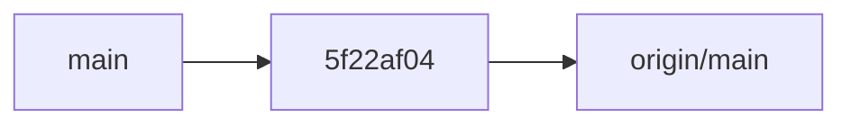
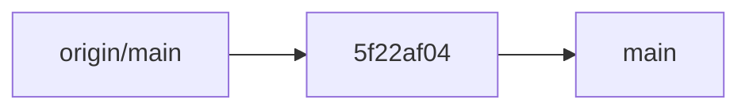
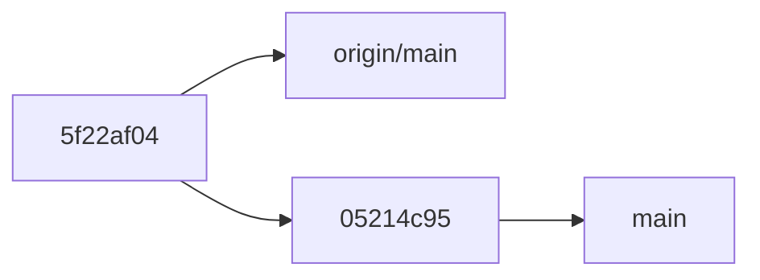

# git-branch-assistant

**git-branch-assistant** is a command line application to manage your git repositories and synchronize branches with their upstreams. There are many other tools with similar functionality[^1]; this one is built to support the workflow I personally prefer. I use it together with my [assistant](https://github.com/skagedal/assistant) tool, but it can be used as a standalone program.

If you plan to contribute, please read the short [Repository Guidelines](AGENTS.md) for project layout, coding style, and workflow expectations.

## Git cleanup

The `git-branch-assistant git-clean` command cleans up branches in the git repository of the current working directory.

It compares each branch to its upstream and takes different actions depending on the current state. It uses the following
command to list each branch along with its upstream - try it out in your git repository:

```
$ git branch "--format=%(refname:short):%(upstream:short)"
```

The output may look like this:

```
main:origin/main
my-feature:origin/my-feature
new-branch:
```

We see that there is a `main` branch with the upstream `origin/main`, a `my-feature` branch with the upstream `origin/my-feature` and a `new-branch` branch without an upstream.

For each pair of local branch and its upstream, one of the following situations are possible. 

### No upstream

If you have a branch that you, for example, have just created locally, it does not have an upstream.  We see this above with the `new-branch` branch.

For this situation, `git-branch-assistant` provides the following options:

* Push and create pull request [default choice]
* Push to create origin
* Delete it
* Show git log
* Exit to shell with branch checked out
* Do nothing

### Branches are identical

When the local branch is pointing to the same commit as its upstream, there is nothing to do and we just continue processing the branches. 

### Upstream is ahead

Let's say the situation for `main` and its upstream looks like this.



The origin is two commits ahead of our local main – you can read the arrows as illustrating the relation "is the parent of". (In reality, it is rather the child commit that is "pointing to" the parent, but it feels more natural to illustrate it this way somehow.)

Whenever the local branch is an _ancestor_ of its upstream, we can fast-forward the local branch to the upstream. `git-branch-assistant` will do this using `git rebase`, which in this case has the same effect as a fast-forward pull, but can be done on a branch other than the one currently checked out.

### Local branch is ahead

The opposite situation to the above is when the local branch is ahead of its upstream. 



Here, the natural thing to do is to push the local branch to the upstream. `git-branch-assistant` will however stop for an interactive confirmation in this step, and show the following options:

* Push to origin (default)
* Show git log
* Exit to shell with branch checked out
* Do nothing

### Diverged branches

When it is neither the case that the local branch is an ancestor of the upstream nor the opposite, the branches have diverged. 



In this case, we need to decide how to proceed. In my personal workflow, this is not a very common scenario. 
I usually do any commits on feature branches that only I work on. But it happens that I will use a feature like
Github's "merge in main" or there will be a suggested-fix-commit from a coworker on a pull request branch. 
The most common thing I will want to do then is to rebase the local branch on the upstream branch, so that's the default choice.

### Upstream is set, but it doesn't exist

The last situation is when the local branch has an upstream set, but it doesn't exist.
This usually happens when a pull request has been merged, so the default suggestion will be to remove the local branch.

## Git repos management

The `git-branch-assistant git-repos` command provides batch management for multiple git repositories. When run from a directory containing multiple git repositories (as subdirectories), it will:

1. Scan all subdirectories in the current directory
2. Check each directory to see if it's a git repository
3. For each repository, check its status:
   - **Dirty repositories**: Repositories with uncommitted changes are reported so you can review them
   - **Branches needing action**: Repositories where branches need syncing with upstreams are automatically processed using the same logic as `git-clean`

This command is particularly useful when you maintain multiple related repositories and want to ensure they're all in a clean, synchronized state. It will interactively handle any repositories that need attention, allowing you to quickly clean up branches across your entire workspace.

---

[^1]: See for example [myrepos](https://myrepos.branchable.com/) and its list of [related tools](https://myrepos.branchable.com/related/)
